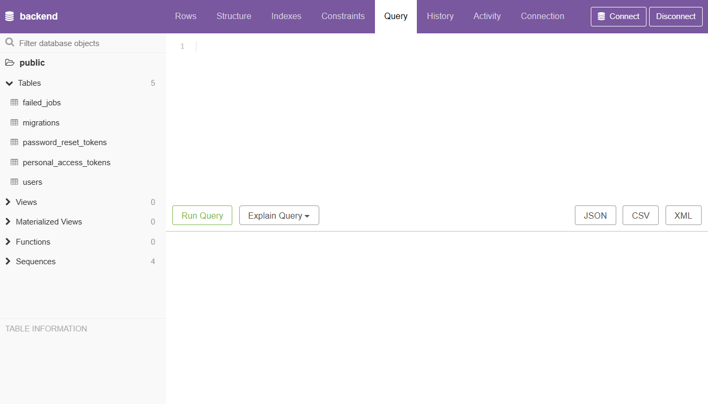
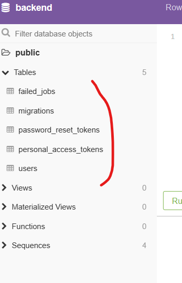
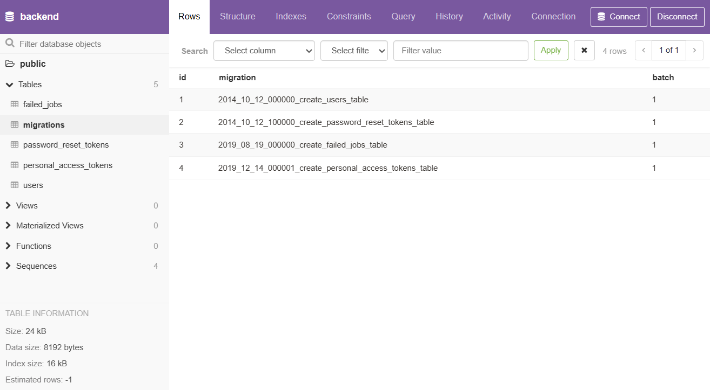
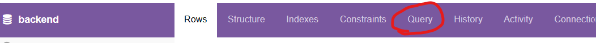
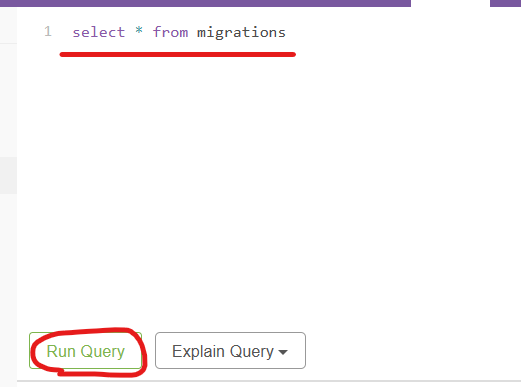
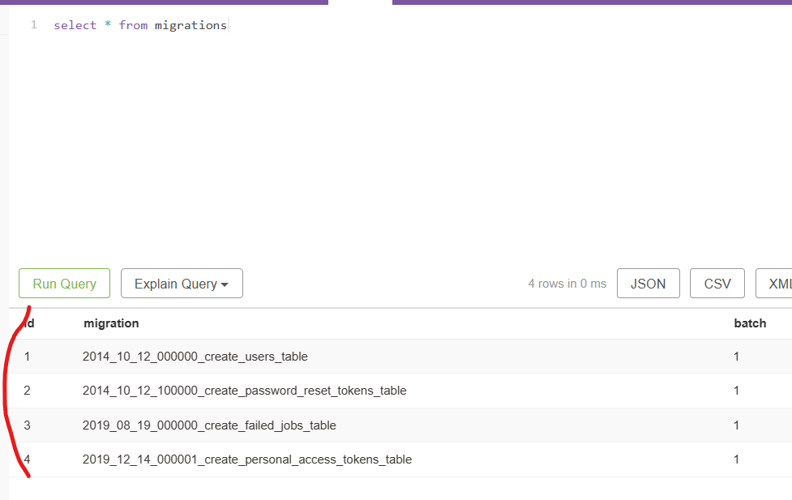

# 目次

- [Git](#git)
  - [ソースコードのダウンロード](#git-clone)
- [初期設定](#initialize)
  - [環境変数の設定](initialize-env)
  - [開発コンテナの作成](initialize-container)
- [Frontend](#frontend)
  - [初期設定](#frontend-initialize)
  - [起動](#frontend-run)
  - [停止](#frontend-stop)
  - [ビルド](#frontend-build)
- [Backend](#backend)
  - [初期設定](#backend-initialize)
  - [起動](#backend-run)
  - [停止](#backend-stop)
- [VSCode](#vscode)
  - [拡張機能のインストール](#vscode-extensions)
- [開発](#develop)
- [pgweb の操作方法](#pgweb)
  - [表示](#pgweb-login)
  - [テーブルの内容を確認する](#pgweb-show-table)
  - [SQL の実行](#pgweb-execute-sql)

<a id="git"></a>

# Git

<a id="git-clone"></a>

## ソースコードのダウンロード

Ubuntu のターミナルを開き、任意のディレクトリで以下のコマンドを実行します。

```bash
git clone <このリポジトリのURL>
code <リポジトリ名>
```

VSCode 起動後は[拡張機能のインストール](#vscode-extensions)を行ってください。  
インストール後は VSCode を閉じてしまって問題ありません。

<a id="initialize"></a>

# 初期設定

<a id="initialize-env"></a>

## 環境変数の設定

Ubuntu ターミナルで以下のコマンドを実行し、必要な環境変数を設定します。

```bash
# .env ファイルの生成
cp .env.example .env
```

パスワード等の秘密情報には、任意の値を入れてください。

<a id="initialize-container"></a>

## 開発コンテナの作成と準備

docker を起動後に以下のコマンドを実行し、開発コンテナを作成、起動します。

```bash
docker compose up -d
```

`Ctrl + Shift + P`を押して、`Dev Containers: Attach to Running Container...`を選択し、`backend`及び`frontend`を選択して`Enter`を押し、開発コンテナに入ります。

`Ctrl + J`もしくは`Ctrl + @`でターミナルを開き、以下のコマンドを入力してワークスペースを開きます。

```bash
code /app
```

推奨の拡張機能をインストールします。

<a id="frontend"></a>

# Frontend

<a id="frontend-initialize"></a>

## 初期設定

Ubuntu ターミナルで以下のコマンドを実行し、VSCode を起動します。

```bash
code frontend/
```

VSCode 起動後は[拡張機能のインストール](#vscode-extensions)を行ってください。

<a id="frontend-run"></a>

## 起動

VSCode で `Shift + Ctrl + @` を押下してターミナルを表示し、以下のコマンドを実行してください。

```bash
# .env ファイルの生成
cp .env.example .env
# パッケージのインストールとアプリの起動
npm install && npm run dev
```

起動後は以下の URL に接続できますので、実際にアクセスして確認してください。

- http://localhost:3000

<a id="frontend-stop"></a>

## 停止

起動コマンドを入力した VSCode のターミナルで `Ctrl + C` を入力します。

<a id="frontend-build"></a>

## ビルド

ビルドを行うには以下のコマンドを実行してください。

```bash
# ビルドコマンド
npm run build
```

<a id="backend"></a>

# Backend

<a id="backend-initialize"></a>

## 初期設定

Ubuntu ターミナルで以下のコマンドを実行し、VSCode を起動します。

```bash
code backend/
```

VSCode 起動後は[拡張機能のインストール](#vscode-extensions)を行ってください。

その後 `Shift + Ctrl + @` を押下し、ターミナルを表示して以下のコマンドを実行してください。

```bash
# .env ファイルの生成
cp .env.example .env
# Composer パッケージの初期化
docker run --rm \
    -u "$(id -u):$(id -g)" \
    -v $(pwd):/var/www/html \
    -w /var/www/html \
    laravelsail/php83-composer:latest \
    composer install --ignore-platform-reqs
# sail のエイリアス
alias sail='[ -f sail ] && bash sail || bash vendor/bin/sail'
```

<a id="backend-run"></a>

## 起動

VSCode のターミナルで以下のコマンドを実行します。

```bash
sail up -d
```

初回起動時は続けて以下のコマンドを実行してください。

```bash
sail artisan key:generate
```

起動後は以下の URL に接続できますので、実際にアクセスして確認してください。

- Laravel: http://localhost:8000
- pgweb(DB 管理): http://localhost:8081

<a id="backend-stop"></a>

## 停止

VSCode のターミナルで以下のコマンドを実行します。

```bash
docker compose down
```

<a id="vscode"></a>

# VSCode

<a id="vscode-extensions"></a>

## 拡張機能のインストール

VSCode が起動したら右下に画像のような通知が表示されるため、「インストール」を選択します。  


> **Note**
>
> ### 通知が表示されない・通知を閉じてしまった場合
>
> 1. `Shift + Ctrl + P` を押下し、テキストボックスに `recommend` と入力します。
> 2. 「拡張機能: ワークスペース フォルダーの推奨事項に拡張機能を追加する」を選択します。
>    
>    - または `Shift + Ctrl + X` を押下し、テキストボックスに `@recommended` と入力します。
>      
> 3. 表示された拡張機能をすべてインストールしてください。

<a id="develop"></a>

# 開発

以下を参考に開発を行ってください。

- [Next.js の開発について](https://nextjs.org/)
- [Django の開発について](https://docs.djangoproject.com/ja/5.2/)

[frontend/src/app/sample/page.tsx](http://localhost:3000/sample) に API 通信のサンプルを実装してあるため、こちらも参考程度に目を通しておいてください。

<a id="pgweb"></a>

# pgweb の操作方法

<a id="pgweb-login"></a>

## 表示

http://localhost:8081 に接続すると以下の画面が表示されます。  


<a id="pgweb-show-table"></a>

## テーブルの内容を確認する

1. 画面左メニュー `Tables` から参照したいテーブルを選択します。  
   
1. 選択したテーブルに登録されているデータが表示されます。  
   

<a id="pgweb-execute-sql"></a>

## SQL の実行

1. ヘッダメニューから `Query` を選択します。  
   
1. SQL を入力し `Run Query` をクリックします。  
   
1. 実行結果が画面下部に表示されます。  
   
