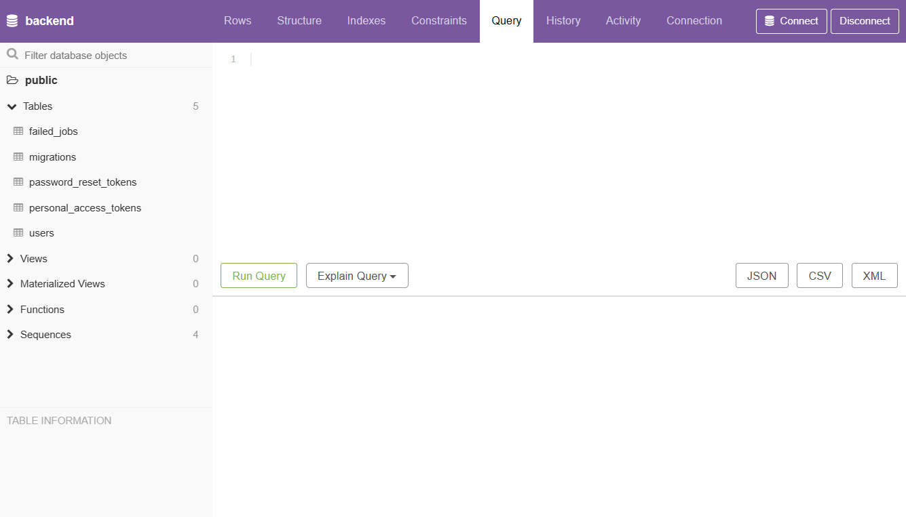
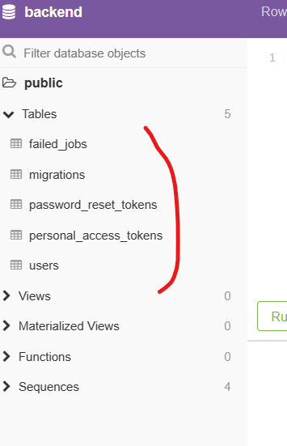
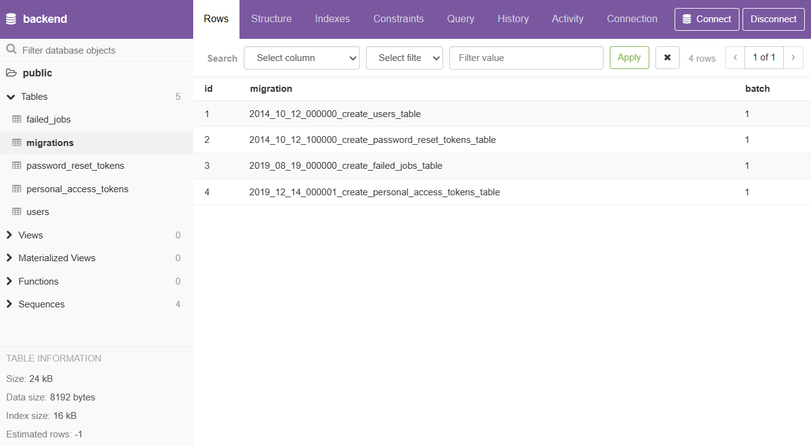
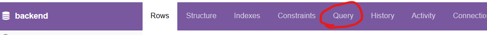
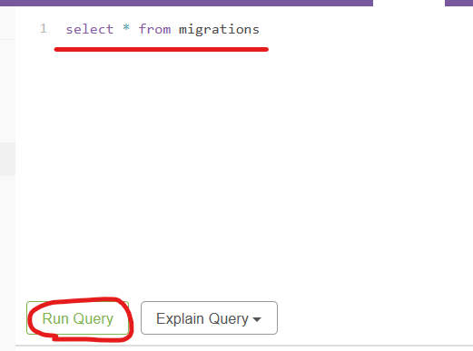
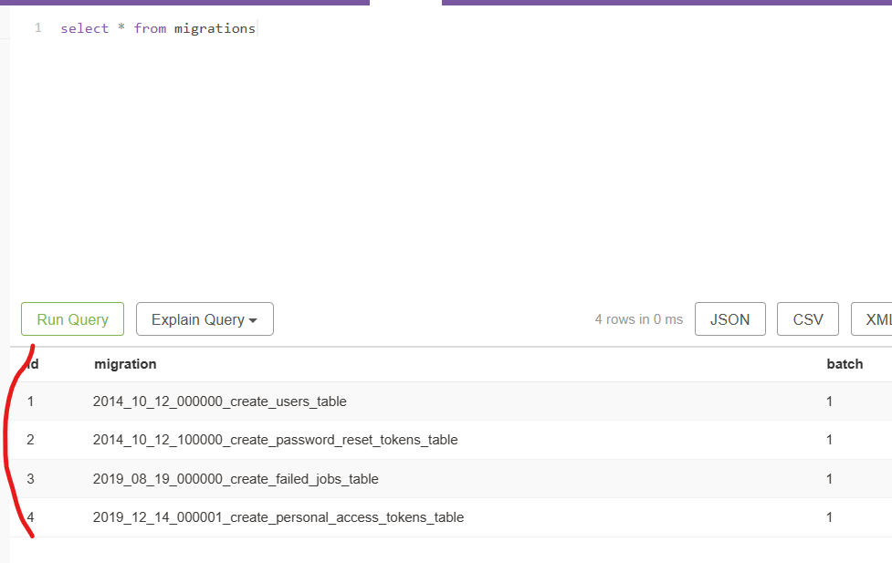

# 技術研修テンプレート

このリポジトリは、以下の構成で作られた研修用テンプレートです。

- フロントエンド: Next.js
- バックエンド: Django REST Framework
- データベース: PostgreSQL
- 開発環境: Docker Compose
- DB確認ツール: pgweb

Docker を使って開発環境を立ち上げる前提のため、PHP 向けのセットアップは不要です。

## 目次

- [1. 開発環境の全体像](#1-開発環境の全体像)
- [2. 事前に準備するもの](#2-事前に準備するもの)
- [3. ソースコードを取得する](#3-ソースコードを取得する)
- [4. 環境変数を設定する](#4-環境変数を設定する)
- [5. 開発環境を起動する](#5-開発環境を起動する)
- [6. 動作確認を行う](#6-動作確認を行う)
- [7. 日常的によく使うコマンド](#7-日常的によく使うコマンド)
- [8. VS Code のおすすめ設定](#8-vs-code-のおすすめ設定)
- [9. ディレクトリ構成の見方](#9-ディレクトリ構成の見方)
- [10. 学習を進めるときの参考情報](#10-学習を進めるときの参考情報)
- [11. pgweb の使い方](#11-pgweb-の使い方)
- [12. 開発環境を停止・作り直す](#12-開発環境を停止作り直す)

## 1. 開発環境の全体像

`docker compose up -d` を実行すると、次のコンテナが起動します。

| サービス | 役割 | ポート |
| --- | --- | --- |
| `frontend` | Next.js アプリ | `3000` |
| `backend` | Django API | `8000` |
| `pgsql` | PostgreSQL | `5432` |
| `pgweb` | DB をブラウザから確認するツール | `8081` |

ブラウザから確認できる URL は以下です。

- フロントエンド: http://localhost:3000
- バックエンド: http://localhost:8000/admin/
- pgweb: http://localhost:8081

## 2. 事前に準備するもの

この README は、Windows + WSL2 + Docker Desktop で開発する前提で書いています。  
作業を始める前に、以下を準備してください。

- Windows に WSL2 を有効化していること
- WSL2 上に Ubuntu をインストールしていること
- Windows 側に Docker Desktop をインストールしていること
- Windows 側に Visual Studio Code をインストールしていること
- WSL2 の Ubuntu 側で `git` が使えること

Docker Desktop では、WSL Integration を有効にしておいてください。  
以降のコマンドは、特に断りがない限り WSL の Ubuntu ターミナルで実行します。

## 3. ソースコードを取得する

WSL の Ubuntu ターミナルを開き、任意のディレクトリで以下を実行します。

```bash
git clone <このリポジトリのURL>
cd technical-training-template
code .
```

`code .` を実行すると、VS Code が WSL 経由でこのリポジトリを開きます。  
以降の作業は、基本的にこのリポジトリ直下で行います。

## 4. 環境変数を設定する

このプロジェクトでは、`backend` と `frontend` でそれぞれ `.env` ファイルを使います。

### 4-1. backend の `.env` を作成する

```bash
cp backend/.env.example backend/.env
```

`backend/.env` を開き、少なくとも以下を確認・設定してください。

- `ADMIN_USER`
  - Django の管理ユーザー名です。
- `ADMIN_PASS`
  - Django の管理ユーザーのパスワードです。
- `POSTGRES_PASSWORD`
  - PostgreSQL のパスワードです。
- `JWT_SECRET_KEY`
  - JWT の署名に使う秘密鍵です。

`JWT_SECRET_KEY` は学習用であっても固定値のままにせず、次のコマンドで作り直してください。

```bash
openssl rand -hex 32
```

設定例:

```env
DEBUG=True
DJANGO_ALLOWED_HOSTS=backend,localhost,127.0.0.1

ADMIN_USER=admin
ADMIN_PASS=adminpass123

POSTGRES_DB=technical-training-database
POSTGRES_USER=user
POSTGRES_PASSWORD=devpass123
POSTGRES_HOST=pgsql
POSTGRES_PORT=5432

JWT_SECRET_KEY=ここに openssl rand -hex 32 の結果を貼る
```

### 4-2. frontend の `.env` を作成する

```bash
cp frontend/.env.example frontend/.env
```

通常は初期値のままで問題ありませんが、以下を確認してください。

- `NEXT_PUBLIC_API_BASE_URL`
  - フロントエンドが API を呼び出す先です。
- `JWT_SECRET_KEY`
  - フロントエンド側の認証処理でも利用します。
  - `backend/.env` と同じ値にしてください。

設定例:

```env
NEXT_PUBLIC_API_BASE_URL=http://localhost:8000/api/
JWT_SECRET_KEY=backend/.env と同じ値
```

## 5. 開発環境を起動する

### 5-1. コンテナを起動する

```bash
docker compose up -d --build
```

初回はイメージ作成が入るため、少し時間がかかります。

### 5-2. 起動状態を確認する

```bash
docker compose ps
```

`backend` `frontend` `pgsql` `pgweb` が起動していれば準備完了です。

### 5-3. 起動時に自動で行われること

`backend` コンテナでは、起動時に以下が自動実行されます。

1. PostgreSQL が起動するまで待機
2. マイグレーションの作成
3. マイグレーションの適用
4. 管理ユーザーの作成
5. Django 開発サーバーの起動

つまり、初回でも追加の手作業なしで最低限の開発環境が立ち上がる構成です。

## 6. 動作確認を行う

コンテナ起動後、以下を順番に確認してください。

### 6-1. フロントエンドを開く

http://localhost:3000

画面が表示されれば、Next.js は正常に起動しています。

### 6-2. バックエンドを開く

http://localhost:8000/admin/

Django の管理画面が表示されれば、バックエンドは正常です。
なお、`http://localhost:8000/` はルート URL を定義していないため 404 になりますが、これは正常です。

### 6-3. API サンプルページを開く

http://localhost:3000/sample

この画面では、フロントエンドからバックエンド API を呼び出すサンプルを確認できます。  
研修を進める前に、[frontend/src/app/sample/page.tsx](/Volumes/workspace/adglobe/technical-training-template/frontend/src/app/sample/page.tsx) を一度読んでおくことを推奨します。

### 6-4. pgweb を開く

http://localhost:8081

pgweb で PostgreSQL に接続できれば、DB 周りも正常です。

## 7. 日常的によく使うコマンド

### コンテナの起動

```bash
docker compose up -d
```

### コンテナの停止

```bash
docker compose down
```

### ログを確認する

```bash
docker compose logs backend
docker compose logs frontend
```

### Django のテストを実行する

```bash
docker compose exec backend python manage.py test
```

### バックエンドの lint を実行する

```bash
docker compose exec backend ruff check src
```

### バックエンドの format を実行する

```bash
docker compose exec backend ruff format src
```

### Django の管理コマンドを実行する

```bash
docker compose exec backend python manage.py <command>
```

例:

```bash
docker compose exec backend python manage.py showmigrations
docker compose exec backend python manage.py createsuperuser
```

### フロントエンドの lint を実行する

```bash
docker compose exec frontend npm run lint
```

### フロントエンドの本番ビルドを確認する

```bash
docker compose exec frontend npm run build
```

### フロントエンドのテストについて

フロントエンドのテストは、今後 `Vitest` と `React Testing Library` を使う方針です。  
現時点では README で案内する共通テストコマンドは未整備のため、最低限 `lint` と `build` を通してください。

## 8. VS Code のおすすめ設定

WSL のターミナルで `code .` を実行して開いた VS Code 上で、推奨拡張機能のインストールを行ってください。

右下に通知が出た場合は、そのまま「インストール」を選択してください。  
通知が出ない場合は、以下の手順で確認できます。

1. `Ctrl + Shift + P` を押します。
2. `Extensions: Show Recommended Extensions` を選びます。
3. 表示された拡張機能をインストールします。

## 9. ディレクトリ構成の見方

主に見る場所は以下です。

```text
.
├── backend
│   ├── src
│   │   ├── api        # API関連のアプリ
│   │   └── core       # 設定、共通処理、管理コマンドなど
│   ├── manage.py
│   └── entrypoint.sh
├── frontend
│   └── src
│       ├── app        # Next.js App Router
│       ├── lib        # API呼び出しなどの共通処理
│       ├── types      # 型定義
│       └── proxy.ts   # 認証状態に応じたリダイレクト処理
└── compose.yml
```

## 10. 学習を進めるときの参考情報

### フロントエンド

- [Next.js 公式ドキュメント](https://nextjs.org/docs)
- [App Router の説明](https://nextjs.org/docs/app)

### バックエンド

- [Django 公式ドキュメント](https://docs.djangoproject.com/ja/6.1/)
- [django-admin / manage.py](https://docs.djangoproject.com/ja/6.1/ref/django-admin/)
- [URL ルーティング](https://docs.djangoproject.com/ja/6.1/topics/http/urls/)
- [Django モデル](https://docs.djangoproject.com/ja/6.1/topics/db/models/)
- [マイグレーション](https://docs.djangoproject.com/ja/6.1/topics/migrations/)
- [フィクスチャ](https://docs.djangoproject.com/ja/6.1/howto/initial-data/)

研修中は「画面を作る処理」と「API を返す処理」が別の場所にある点を意識すると、構成を理解しやすくなります。

## 11. pgweb の使い方

pgweb は、PostgreSQL の中身をブラウザから確認するためのツールです。

### 11-1. 表示

http://localhost:8081 に接続すると以下の画面が表示されます。  


### 11-2. テーブルの内容を確認する

1. 左側メニューの `Tables` から確認したいテーブルを選択します。  
   
2. 選択したテーブルのデータが一覧で表示されます。  
   

### 11-3. SQL を実行する

1. ヘッダメニューから `Query` を選択します。  
   
2. SQL を入力して `Run Query` をクリックします。  
   
3. 実行結果が画面下部に表示されます。  
   

## 12. 開発環境を停止・作り直す

### 停止するだけの場合

```bash
docker compose down
```

### DB のデータも含めて完全に作り直す場合

以下を実行すると、PostgreSQL のデータは削除されます。

```bash
docker compose down -v
docker compose up -d --build
```

`.env` の内容を大きく変更したときや、DB の状態を最初からやり直したいときに使ってください。

## Appendix: 開発の基礎知識

### A-1. `.env` を Git に上げてはいけない理由

`.env` には、パスワードや秘密鍵などの重要な情報が入ります。  
これを Git にコミットすると、以下のような問題が起こります。

- パスワードや秘密情報が他の人に見えてしまう
- 一度コミットすると、履歴から完全に消すのが大変
- 開発者ごとに違う設定まで共有され、環境が壊れやすくなる

そのため、このリポジトリでは `.env.example` を共有し、実際の値は各自の `.env` にだけ書く運用にしています。

### A-2. migration とは何か

migration は、データベースの構造変更をコードで管理する仕組みです。  
たとえば「テーブルを追加する」「カラムを増やす」といった変更を、手作業ではなく履歴として残せます。

このプロジェクトでは主に次の 2 つを使います。

- `python manage.py makemigrations`
  - モデルの変更内容から、どのように DB を変更するかのファイルを作ります。
- `python manage.py migrate`
  - 作成された migration を実際の DB に反映します。

つまり、`makemigrations` は「変更計画を作る」、`migrate` は「実際に反映する」です。

### A-3. コンテナを消しても消えないもの / 消えるもの

Docker では、よく似た言葉がいくつかあります。

- コンテナ
  - 実際に動いている実行環境です。
- イメージ
  - コンテナを作る元になる設計図です。
- ボリューム
  - コンテナを消しても残したいデータを保存する場所です。

`docker compose down` では、通常はコンテナだけが停止・削除されます。  
一方で `docker compose down -v` を使うと、ボリュームも削除されるため、PostgreSQL のデータも消えます。

### A-4. バックエンドとフロントエンドの役割分担

このリポジトリでは、フロントエンドとバックエンドが役割分担しています。

- フロントエンド: Next.js
  - 画面を表示し、ユーザーの操作を受け取ります。
- バックエンド: Django
  - データの保存、取得、認証、業務ロジックを担当します。

画面の見た目を作る場所と、データを処理する場所は別であると考えると理解しやすいです。

### A-5. API とは何か

API は、フロントエンドとバックエンドがデータをやり取りするための窓口です。  
このプロジェクトでは、Next.js から Django の API に HTTP 通信でリクエストを送り、結果を受け取ります。

たとえば以下のような流れです。

1. フロントエンドが「ユーザー一覧をください」と API に送る
2. バックエンドが DB からデータを取り出す
3. 結果を JSON で返す
4. フロントエンドがそのデータを画面に表示する

### A-6. PostgreSQL と pgweb の役割

`PostgreSQL` は、実際にデータを保存するデータベース本体です。  
`pgweb` は、その PostgreSQL の中身をブラウザで見やすく確認するための補助ツールです。

つまり、役割は次のように分かれています。

- PostgreSQL
  - データを保存する
- pgweb
  - 保存されたデータを確認する

pgweb は便利な確認ツールですが、データそのものを保存しているわけではありません。

### A-7. 開発環境・検証環境・本番環境の違い

システム開発では、同じアプリでも使う場所によって環境を分けます。

- 開発環境
  - 開発者がローカルで作業する環境
- 検証環境
  - 本番に近い条件で確認する環境
- 本番環境
  - 実際の利用者が使う環境

環境ごとに接続先や秘密情報が違うため、`.env` の値も同じではありません。  
「ローカルで動いたから終わり」ではなく、他の環境でも同じように動くかを確認する必要があります。

### A-8. ポート番号とは何か

ポート番号は、同じ PC の中で「どのアプリにつなぐか」を区別する番号です。

このプロジェクトでは主に以下を使います。

- `3000`: フロントエンド
- `8000`: バックエンド
- `8081`: pgweb

たとえば `http://localhost:3000` は、「自分の PC 上で 3000 番ポートを使っているアプリに接続する」という意味です。

### A-9. `localhost` とは何か

`localhost` は、自分自身の PC を指す特別な名前です。  
ブラウザで `http://localhost:3000` にアクセスする場合は、「今使っている PC 上で動いている 3000 番ポートのアプリ」を見ています。

ただし Docker では、コンテナごとに見える相手が少し異なります。  
そのため、ブラウザからは `localhost` で見えても、コンテナ同士では `backend` や `pgsql` というサービス名で通信することがあります。

### A-10. WSL2 を使う理由

この研修では、Windows 上で直接すべてを動かすのではなく、WSL2 上の Ubuntu で作業する前提にしています。

主な理由は以下です。

- Linux 系の開発環境に近い形で作業できる
- Docker との相性がよい
- シェルコマンドや開発ツールの情報が一般的な Linux 向け資料と合わせやすい

実務でも、サーバーは Linux 系で動くことが多いため、WSL2 に慣れておく価値があります。

### A-11. ログを見る理由

アプリがうまく動かないとき、まず確認するべきものの 1 つがログです。  
ログには、起動失敗の原因やエラーメッセージが出ます。

たとえば以下のコマンドで確認できます。

```bash
docker compose logs backend
docker compose logs frontend
```

「画面が開かない」「API が失敗する」といったときに、最初にログを見る習慣をつけると原因調査が早くなります。

### A-12. JWT とは何か

JWT は、認証状態を表すためによく使われるトークン形式です。  
ログイン後に受け取ったトークンを使って、「このユーザーは誰か」をサーバーに伝えます。

`JWT_SECRET_KEY` は、その JWT を安全に扱うための秘密鍵です。  
この値が漏れると、認証に関わる重大な事故につながる可能性があるため、`.env` で管理します。

### A-13. `lint` / `format` / `build` / `test` の違い

開発では似た言葉が並びますが、役割はそれぞれ異なります。

- `lint`
  - コードの書き方やルール違反を検出する
- `format`
  - コードの見た目を自動で整える
- `build`
  - アプリを実行や配布できる形にまとめる
- `test`
  - コードが期待通りに動くか確認する

それぞれ目的が違うため、どれか 1 つ通れば十分というわけではありません。

このリポジトリでは、フロントエンドとバックエンドで使っているものが少し異なります。

#### フロントエンドで使うコマンド

| 種類 | コマンド | 使っているもの | 補足 |
| --- | --- | --- | --- |
| `lint` | `npm run lint` | ESLint | コードのルール違反を確認します。Next.js 16 では `next lint` ではなく ESLint CLI を直接実行します。 |
| `format` | `npm run format` | Prettier | コードの見た目を整えます。 |
| `build` | `npm run build` | Next.js | 本番用ビルドが通るか確認します。 |
| `test` | `npm run test` | Vitest / React Testing Library | コンポーネントやロジックのテストに使います。 |

#### バックエンドで使うコマンド

| 種類 | コマンド | 使っているもの | 補足 |
| --- | --- | --- | --- |
| `lint` | `docker compose exec backend ruff check src` | Ruff | Python コードの静的チェックを行います。 |
| `format` | `docker compose exec backend ruff format src` | Ruff | Python コードの見た目を整えます。 |
| `build` | 日常的な `build` はなし | Django | コンテナ起動とアプリ実行を通して動作確認します。 |
| `test` | `docker compose exec backend python manage.py test` | Django Test | Django のテストを実行します。 |

### A-14. コマンドを打つ場所の整理

Windows 環境では、どこでコマンドを打つかを混同しやすいです。  
このプロジェクトでは主に次の 3 つを意識してください。

- Windows の PowerShell / コマンドプロンプト
  - Windows 側の操作を行う場所です。
- WSL の Ubuntu ターミナル
  - 普段の `git` `docker compose` `code .` などは、基本的にここで実行します。
- Docker コンテナの中
  - `docker compose exec backend ...` のように、`docker compose exec` を使って入ってから実行する場所です。

迷ったときは、まず「そのコマンドは WSL の Ubuntu ターミナルで実行するものか、それとも `docker compose exec ...` を使って Docker コンテナの中で実行するものか」を確認してください。  
たとえば `git clone` や `docker compose up -d` は WSL の Ubuntu ターミナルで実行し、`python manage.py test` は `docker compose exec backend` を付けて Docker コンテナの中で実行します。
